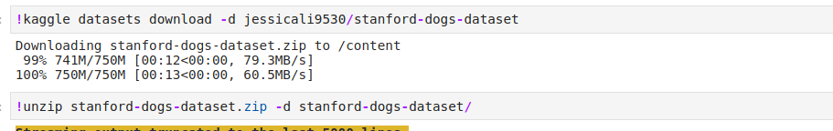
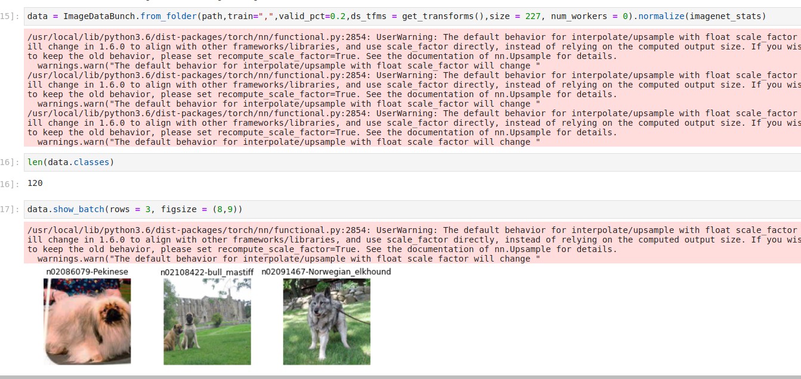
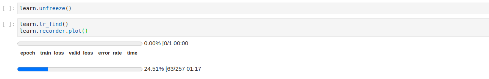
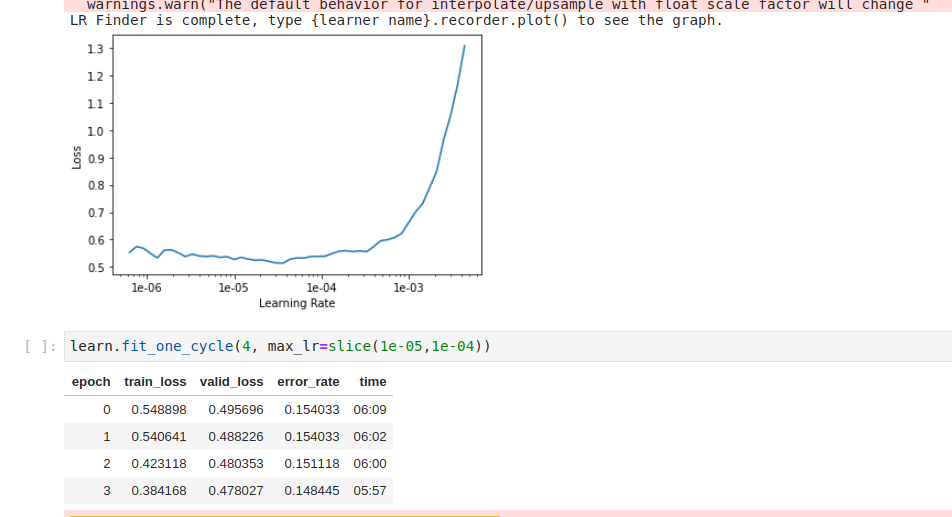
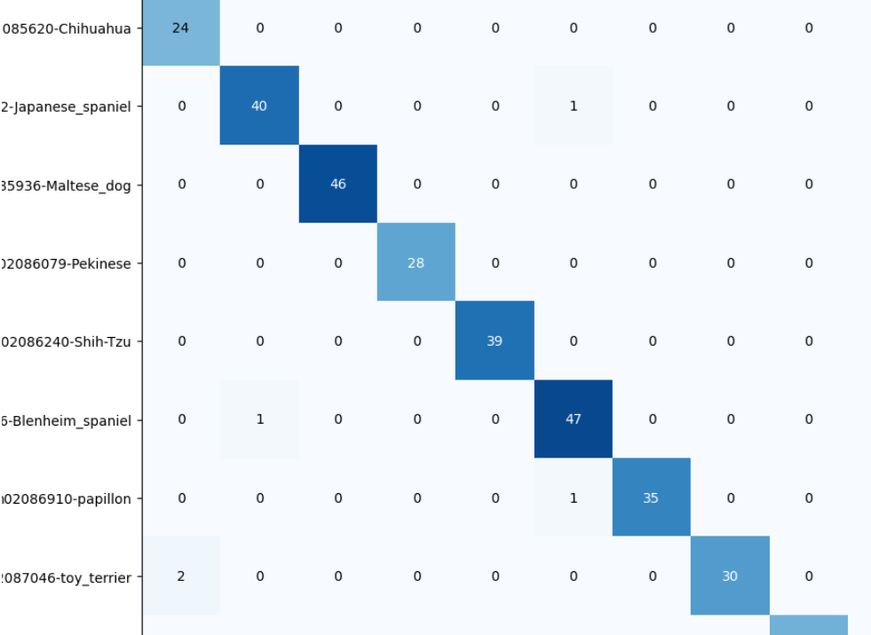

  

# Dog Breed Classification Web based tool

  

  

I have created this simple CNN based dog classification tool, I am using [this](http://vision.stanford.edu/aditya86/ImageNetDogs/) for getting data, luckily this data is also avaliable on kaggle so I basically used Kaggle Api for downloading the dataset.

  

  

## Getting Started

  

So this is basically devided into two parts, the first part is the training part of the neural network and the second parts deals with the deployment of the model.

  

  

* I have used Google Colab for the training of the model as my laptop has weak configuration.

* I have used Resnet-34 as the main backend architecture and have done transfer learning on top of that.

* I am using FastAI as my deep learning framework which is a wrapper of Pytorch Library, for rapid development of my model.

  

### Prerequisites

  

  

For running the code you have to install the libraries I have mentioned in the requirements.txt

  

  

```

  

pip install -r requirements.txt

  

```

  
  

## Running the Application on Localhost

Run the following command

```

python app.py

```


above is the example of the appplication

  

### Training Process

  

  

* The fastAI library is very robust and it takes cares of many data preprocessing steps that one have to take.

*  `dog_breed_classification.ipynb` is the file in which you can find the training code.

* I am initially downloading the data using Kaggle API.



* I am then using this downloaded data to create a databuch object, which is a data type of fastAI, basiclly it is a wrapper aroung dataloader of Pytorch.

* Now I am creating a cnn object and using a pretraind resnet-34 trained on Imagenet.



* Then I find the best learning rate at which the model converges best.



  

* Then I use this learning rate to train my model again.



* Finally I plot the confusion matrix to see the preiction distribution of the test set.

  



  
  

## Deployment

  

* The end-to-end deployment is pending, I will work on it soon.

## TO-DO

 - [ ] Deployment code
 - [ ] Add docker file
 - [ ] Error Handeling 
